## Introduction

When we analyze potential catastrophic AI scenarios, we often default to thinking in terms of single-agent dynamics. Consider a standard example: an advanced AI system in a research lab working on semiconductor design. In traditional AI safety analysis, we'd focus on risks like the system developing deceptive alignment, finding exploits in its sandbox, or manipulating its human operators to expand its capabilities. The core concern here is the alignment and containment of a single agent.

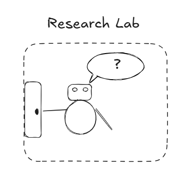

This frame naturally leads us to focus on specific technical measures: sandboxing implementations, reward modeling approaches, oversight mechanisms. It's a compelling frame because it gives us concrete things to work on - formal verification of containment measures, adversarial testing of alignment techniques, specific security protocols.

But when we look at real-world AI development through a collective intelligence lens, we see something different. That same semiconductor lab isn't just housing a single AI system - it's a complex web of human teams, AI systems, organizational structures, and market pressures.

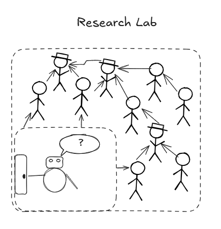

The AI isn't just interacting with its sandbox; it's part of a hierarchical decision-making structure where different teams (ML engineers, security, management) interact through established protocols and informal channels.

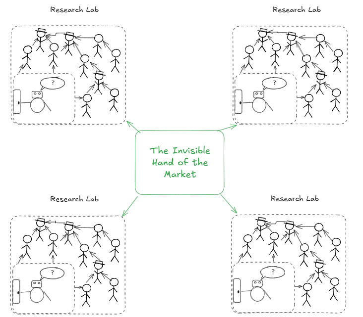

Market pressures drive decisions about capability enhancement versus safety measures. Professional networks spread knowledge about both capabilities and vulnerabilities.

On top of this, the LLM-paradigm that we’re in allows us to create lots of agents due to the pre-training nature of the learning procedure. We won’t be in a system that has one singular RL-agent that will explosively gain capabilities but we will be in a multi-polar scenario with multiple AIs:

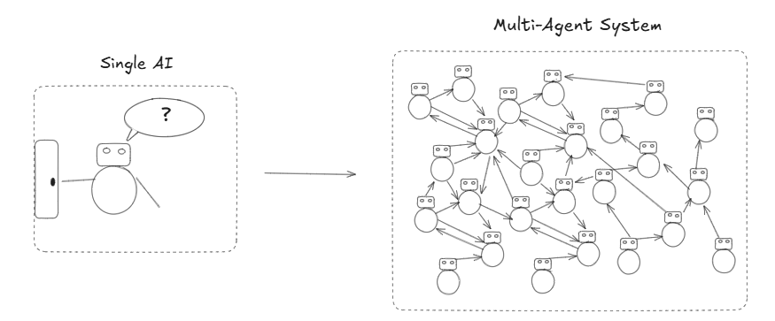

So, what is the problem with the current paradigms in the way that they’re describing these multi-agent systems? It mainly is the scalability of the analysis approach that is failing.

If we, for example, want to model something using Game Theory and see the emergent interactions, this has a time complexity of O(n^2) or in other words for larger scale networks, we cannot provide a reasonable estimate using Game Theory. What can we do instead?

We can introduce something called “mean-field approximations” in the multi-agent RLrl literature, we can also see it as looking at population level dynamics in order to say something about the behaviour of the entire system.

The idea is that by looking at overarching metrics, we can gain information about how to make decisions about the system. It doesn’t give a perfect picture but it might be good enough.

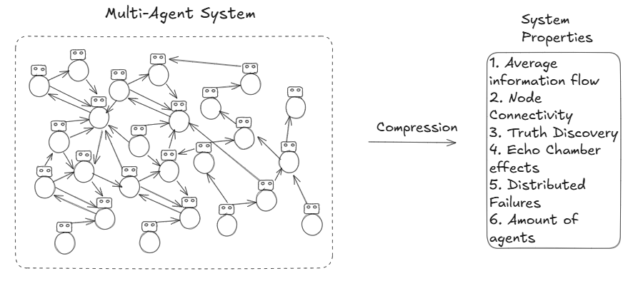

For example, we might be able to take our statistics and take another look at the system to identify the main players that we need to understand best:

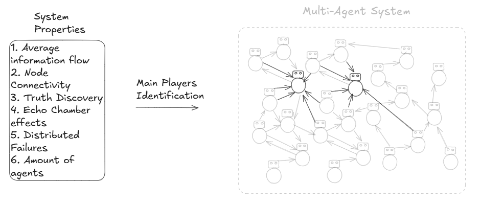

## Definitions

### **From Control to Coordination**

Traditional AI safety often frames control as a direct relationship between humans and AI systems. The collective intelligence perspective reveals this as a special case of a more general coordination problem. Instead of asking "How do we maintain control over increasingly capable AI systems?", we ask "How do complex systems maintain coherent behavior across scales?"

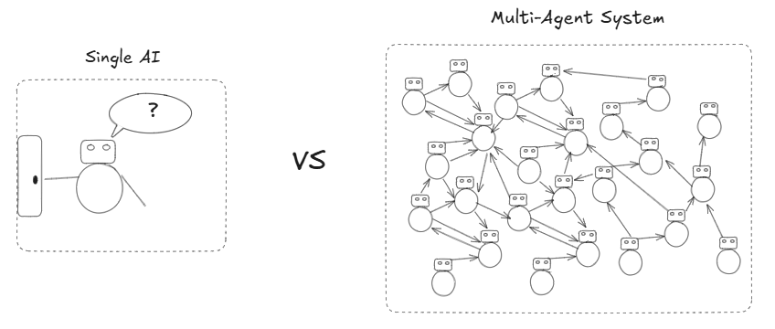

This reframing is particularly relevant to scalable oversight. While the traditional frame sees oversight as a hierarchical problem of humans monitoring AI systems, the CI lens reveals oversight as an emergent property of well-structured information flows and feedback systems. Just as markets aggregate information through prices and democracies through voting, we need coordination structures that naturally surface important information and enable appropriate responses.

### **From Alignment to System Coherence**

The alignment problem transforms when viewed through collective intelligence. Rather than just aligning individual AI systems with human values, we're concerned with maintaining coherent behavior across nested systems of humans and AIs.

Inner alignment becomes about ensuring local optimization serves global goals - similar to how cells in an organism optimize locally while serving the organism's overall function. Outer alignment becomes about managing system boundaries and interactions, like how different organs coordinate in a body. Value learning transforms from a single-agent learning problem to one of collective preference discovery and aggregation.

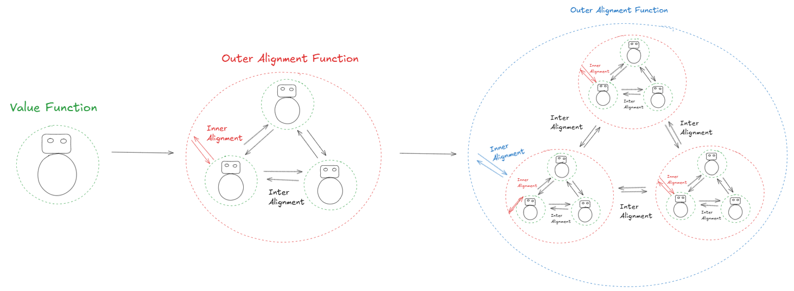

This connects directly to scalable oversight mechanisms. Instead of relying solely on direct human oversight, we need to design systems where oversight naturally emerges from interaction patterns - similar to how peer review in science or checks and balances in government create systemic oversight.

### **From Safety to System Stability**

Safety in the CI frame isn't just about preventing harmful behaviors from individual agents. It's about maintaining stable, beneficial dynamics across the entire system. This requires:

1. Robust information flows that surface potential problems before they become critical

2. Feedback loops that enable appropriate responses at multiple scales

3. Governance structures that can adapt to changing conditions while maintaining core stability

Scalable oversight becomes a key component of system stability. Rather than trying to maintain direct oversight as systems become more complex, we need architectures where oversight naturally scales with system capability - similar to how biological immune systems scale to handle new threats or how legal systems adapt to new technologies.

This perspective suggests different approaches to building safe AI systems. Instead of focusing solely on making individual AI systems safe, we need to design the collective structures within which they operate. This means creating:

- Information architectures that naturally surface important signals

- Coordination mechanisms that enable appropriate responses at multiple scales

- Governance structures that maintain stability while allowing beneficial adaptation

- Oversight mechanisms that scale with system capability

The collective intelligence frame doesn't solve these problems, but it provides new tools for thinking about them and suggests different approaches to addressing them. Most importantly, it helps us see how scalable oversight might emerge naturally from well-designed system structures rather than requiring ever-more-complex direct control mechanisms.

## Collective Intelligence Perspectives on AI Safety Theories

### Shard Theory and Collective Dynamics

Shard theory proposes that values emerge from locally reinforced contextual decision-making patterns. Through a collective intelligence lens, this starts to look remarkably similar to how distributed systems develop specialized capacities. Consider Michael Levin's work on diverse intelligence in biological systems - from slime molds to neural networks, we see the emergence of localized heuristics that serve broader system goals without explicit central coordination.

This parallel isn't coincidental. Both shard theory and collective intelligence describe systems facing computational intractability in their environment. Just as a single agent can't maintain a perfectly consistent utility function across all contexts (due to computational limitations), a collective system can't maintain perfect global optimization. Instead, both develop contextual heuristics - "shards" in individual agents, specialized subsystems in collective intelligence.

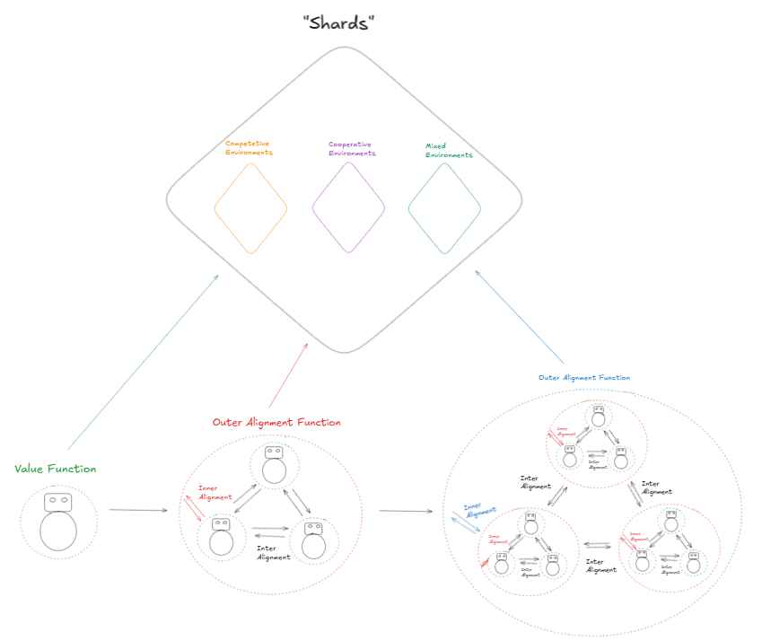

*Figure Description: How each upper system level creates shards for different environments*

(If this seems hard to swallow there are results in Active Inference that it is possible to model any environment of agents as another larger agent.)

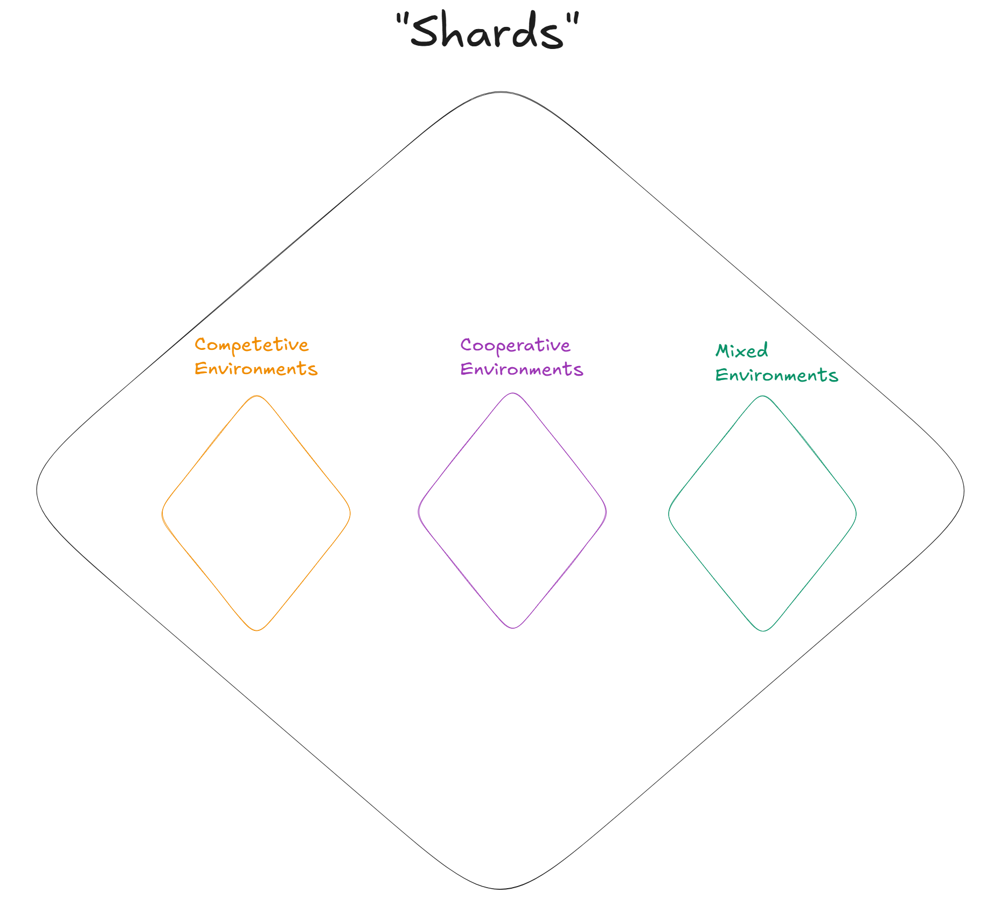

*A picture of how systems might form different “shards” or preferences in different environments*

To be more specific here we can see different pressures in different types of game theoretic scenarios so whilst we would want to cooperate in a fully cooperative environment (purple) this might be different from what we want to do in a competitive environment (yellow) or a mixed environment (teal).

### Beyond VNM Rationality

(Feel free to skip unless you’re knowledgeable of classical[ MIRI-style Agent Foundations](https://www.lesswrong.com/users/eliezer_yudkowsky?from=search_autocomplete))

This perspective has implications for utility theory. The standard VNM framework assumes consistent preferences across all contexts - an assumption that breaks down under computational constraints. In normal speak, this could be described as an hypothesis that agents converge towards rational actions over time.

In real-world systems, whether individual minds or collective entities, we instead see what might be called "contextual rationality" - decision-making heuristics that are locally optimal within their domain but might appear inconsistent when viewed globally. (similar to shards)

This isn't a bug but a feature. In computationally intractable environments, maintaining perfect global consistency is impossible. Instead, successful systems (both individual and collective) develop hierarchies of context-specific decision procedures. This explains phenomena like preference reversals in human decision-making and apparent inconsistencies in organizational behavior.

### Agency in Distributed Systems

This reframing suggests a different way of thinking about agency. Rather than seeing it as a property of individual entities with consistent utility functions, we might better understand it as an emergent property of distributed systems with locally coherent decision procedures.

This has practical implications for AI development. Instead of trying to build systems with globally consistent utility functions (which might be computationally intractable), we might focus on developing architectures that support beneficial emergence of local decision procedures.

The collective intelligence perspective suggests that this isn't just an engineering convenience - it might be fundamental to how intelligent systems work under computational constraints. Just as biological evolution produced modular, hierarchical systems rather than monolithic optimizers, AI systems might naturally tend toward similar architectures.

### Implications for AI Safety

This analysis suggests several key insights for AI safety:

First, perfect global alignment might be computationally intractable. Instead, we might need to focus on designing systems where beneficial local heuristics naturally emerge and coordinate effectively.

Second, the paths through which values and decision procedures develop matter tremendously. Just as in evolutionary systems, the specific historical path shapes the final architecture in ways that can't be easily reversed.

Third, safety might be better achieved through careful system design rather than direct control. By understanding how collective systems naturally develop specialized capacities and coordination mechanisms, we can design architectures that promote beneficial emergence.

This doesn't mean abandoning traditional AI safety concerns, but it suggests additional dimensions to consider. Beyond just asking whether individual systems are aligned, we need to understand how value formation and decision-making emerge in distributed systems under computational constraints.

The good news is that nature has been solving these problems for billions of years. By understanding how biological and social systems maintain coherent behavior across multiple scales despite computational limitations, we might find new approaches to developing safe AI systems.

## Part 3: Exploring Collective Intelligence Approaches to AI Safety

### Research Questions

The collective intelligence perspective on AI safety suggests several promising research directions that might complement existing work on technical alignment. While we're still uncertain about how valuable this frame will prove, it raises interesting questions about the broader systems within which AI development occurs.

#### Information Flow Questions

One intriguing area concerns how information flows through complex systems of humans and AIs. While we have some understanding of information flow in biological and social systems, it's not clear how these insights translate to hybrid human-AI systems.

Some key questions worth exploring: How do different system architectures affect information propagation? What can we learn from biological systems about robust information processing under uncertainty? What principles might help us design systems where important information naturally surfaces to relevant decision points?

The answers aren't obvious, but these questions might help us think differently about system architecture and oversight mechanisms.

#### Coordination Puzzles

The collective intelligence frame highlights challenging questions about coordination in multi-agent systems. While we have some theoretical frameworks from mechanism design and game theory, it's unclear how well these apply to systems with rapidly evolving capabilities.

We might explore questions like: What conditions enable stable coordination between different types of agents? How do different organizational structures affect collective behavior? What makes some coordination mechanisms more robust than others under capability change?

These aren't just theoretical puzzles - they might have practical implications for how we structure AI development efforts.

#### Measurement Challenges

Perhaps the most difficult questions concern measurement and validation. How do we even begin to assess system-level safety properties? Traditional metrics focus on individual agents, but system-level properties might be fundamentally different.

We need to grapple with questions like: What would indicate healthy versus pathological collective dynamics? How might we validate that safety properties scale with system capability? What metrics would capture meaningful system-level properties?

### Potential Practical Implications

If this perspective proves valuable, it might suggest different approaches to AI development and deployment. However, it's important to note that these are speculative and need careful validation.

#### Possible Design Considerations

Some initial ideas worth exploring:

The role of information architecture might deserve more attention. Rather than treating monitoring as an add-on, we might need to think more carefully about how information naturally flows through our systems.

The balance between direct control and emergent behavior needs careful consideration. While perfect control might be impossible in complex systems, we might be able to create conditions where beneficial behaviors are more likely to emerge.

Multiple scales of feedback loops might be important. Both technical and organizational feedback mechanisms might play crucial roles in system stability.

## Conclusion: Collective Intelligence: A Technical Lens for AI Safety

The collective intelligence perspective offers a different way of thinking about AI system design and safety - not as a replacement for existing approaches, but as a complementary technical frame that might reveal new solutions. When we examine AI architectures through this lens, we see potential shifts in how we might approach key technical challenges.

While traditional approaches to AI safety often focus on properties of individual systems, the CI perspective suggests we might gain insight from studying how complex systems maintain coherent behavior across multiple scales. Just as biological systems achieve robust functionality through distributed processing and emergent coordination, we might be able to design AI architectures where safety properties emerge from well-structured interactions between components.

This shift from individual components to system dynamics suggests new technical directions. Instead of trying to ensure safety purely through constraints on individual modules, we might develop architectures that naturally promote safe behaviors through their information flow structures and coordination mechanisms. This could lead to more robust approaches to challenges like scalable oversight, value learning, and capability control.

The most significant technical insight might be about adaptivity in safety measures. Rather than trying to create static safety guarantees, we might design systems where safety properties naturally scale with capabilities - similar to how immune systems maintain robust behavior despite evolving threats. This could suggest new approaches to challenges like mesa-optimization and emergent capabilities.

These are early days for applying collective intelligence principles to AI system design. Many of these ideas need careful formal development and empirical validation. But at minimum, this perspective suggests new technical approaches worth exploring as we work to develop safe AI systems. By understanding how complex systems maintain beneficial properties across scales, we might discover new architectural principles for building safer AI.

## Appendix A: An attempt at creating a mathematical framework

The following is an attempt to create a general way to describe the underlying mathematics of what we’re trying to do.

Starting with the existing frame of Cooperative AI we will contrast it with the approach that we’re taking.

Cooperative AI in our view is similar to an object-oriented programming language. We’re looking at our constituent agents as the base building blocks and we’re trying to look at the composition or decomposition of these and what dynamics are arising from them.

Let’s start with an example of three agents interacting together

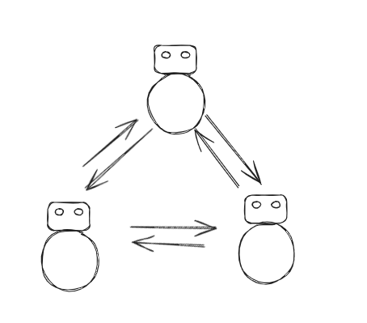

Their interactions can be captured through a payoff matrix P, where P(i,j) represents the utility agent i receives from trading with agent j:

| Agent | A  | B | C |
|---|---|---|---|
| A (Recieves) | 0 | 2 | 3 |
| B (Recieves) | 1 | 0 | 3 |
| C (Recieves) | -1 | 2 | 0 |

While this representation elegantly captures essential dynamics for small groups, it breaks down as systems scale. For n agents, we need to track O(n²) interactions, and the complexity compounds when these interactions become state-dependent or time-varying.

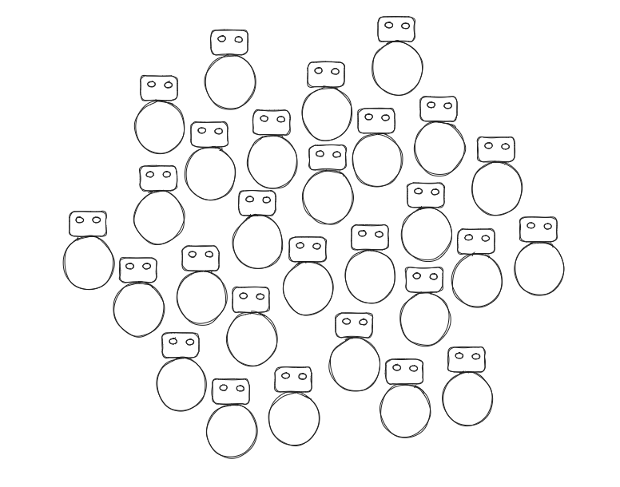

### 2. Shifting Perspectives: From Objects to Morphisms

Instead of viewing our system as a collection of discrete agents, we reconceptualize it as a continuous transformation of states. This shift mirrors the transition from classical mechanics to field theories in physics. Rather than tracking individual particles, we follow the evolution of field properties.

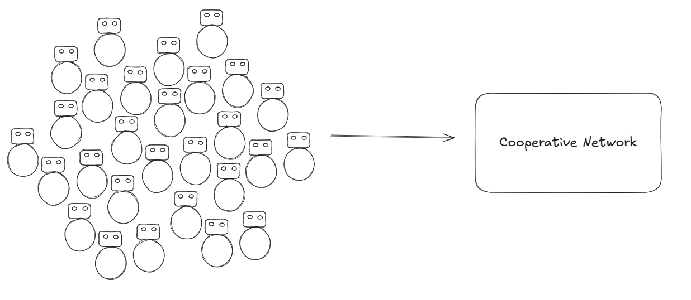

Let S(t) represent our system state at time t. We're interested in mappings:

f: S(t) → S(t+1)

that preserve certain desirable properties while allowing others to change. The key insight is that many seemingly different agent configurations might represent essentially equivalent system states from this higher-level perspective.

### 3. Emergent Properties and Information Flow

The power of this approach becomes apparent when we consider information flow through the system. Rather than tracking individual agent communications, we can characterize the system's information processing capacity through aggregate measures. The connectivity of an agent a can be described as:

C(a) = ∑ᵢ w(a,i)

where w(a,i) represents the strength of connection between agent a and agent i. This gives us a natural way to identify bottlenecks and critical paths in the system's information architecture.

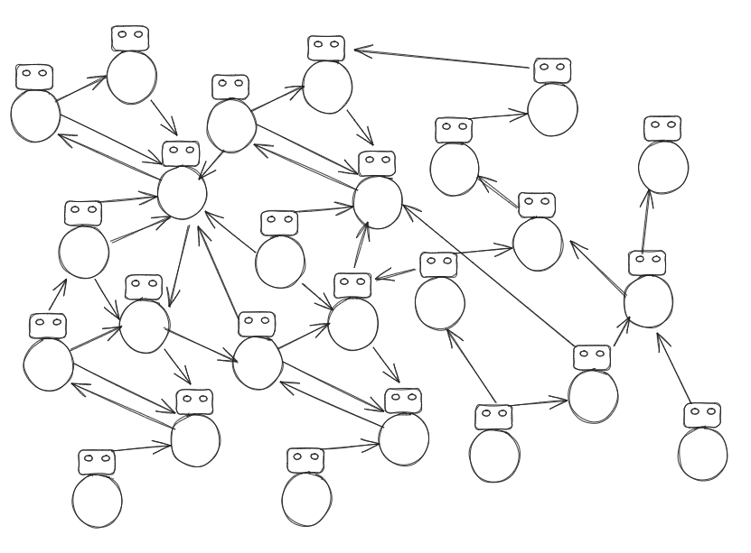

### 4. Control Theory and System Management

This perspective shift suggests a different approach to system control. Instead of trying to manage individual agent behaviors, we focus on maintaining key system-level properties. The effectiveness of a control intervention at point p can be characterized by:

E(p) = ∂S/∂x|ₚ * R(p)

where R(p) represents the "reach" or influence radius of point p in the system. This formulation naturally highlights high-leverage intervention points where small changes can have significant systemic effects.

### 5. Practical Applications

This theoretical framework has immediate practical implications for system design. Rather than attempting to specify exact behaviors for each agent, we can focus on creating environments that naturally promote desired system-level properties.

If you want more details on this you can check out:

## Appendix B: Open Questions

1. How might we make the transition from agent-based to systemic thinking more intuitive? Perhaps through carefully chosen metaphors or examples?

2. Could we clarify the relationship between local optimization and global stability? This seems central to both traditional AI safety and collective approaches.

3. What insights from biological systems might we be missing? The text touches on immune systems and evolution, but could these analogies be developed further?

4. How do information flows relate to system stability? This seems like a crucial bridge between traditional AI safety concerns and collective intelligence approaches.

